### **My Port Folio**

## **About:**
I had to design a personal website suited to my style and taste. The website is to be a means of exposure to who I am and what I'm about. To construct this site, I took a step-by-step approach. First I had the pre-planning phase, then the planning phase, then the building phase and finally the execution phase.

## **Design/ set-out Insipiaration**
    
I spent a lot of time looking at other website designs to develop some ideas for my site.  

I found one site that I really liked and decided to stick with it. Have a look at the images below:

MOBILE VIEW:

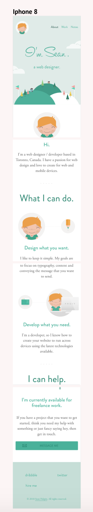

DESKTOP VIEW:

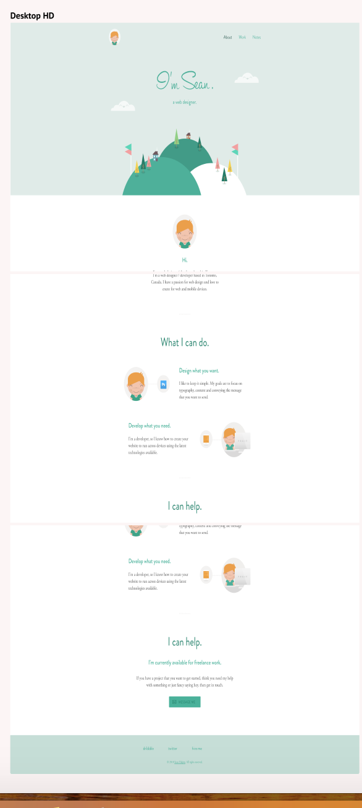

## **Colors**

I got my color inspiration from old art and architecture. I travelled to Turkey last year and I really liked the Ottoman art and architecture. I found the colors beautiful and made me feel at ease. They used colors that made you feel calm and warm. I wanted my personal website to have the same impact on the viewer, and so I dervied my color palettes from some of the Ottoman buildings. I was able to do this using a color palette tool extension on google chrome. Below are the images of the buildings I chose to derive my colour palettes from. 

OTTOMAN BUILDINGS:

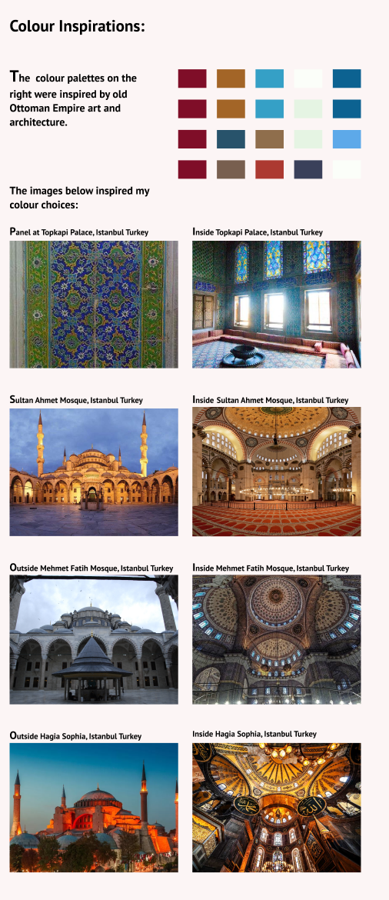

The image below is the color scheme for my website:

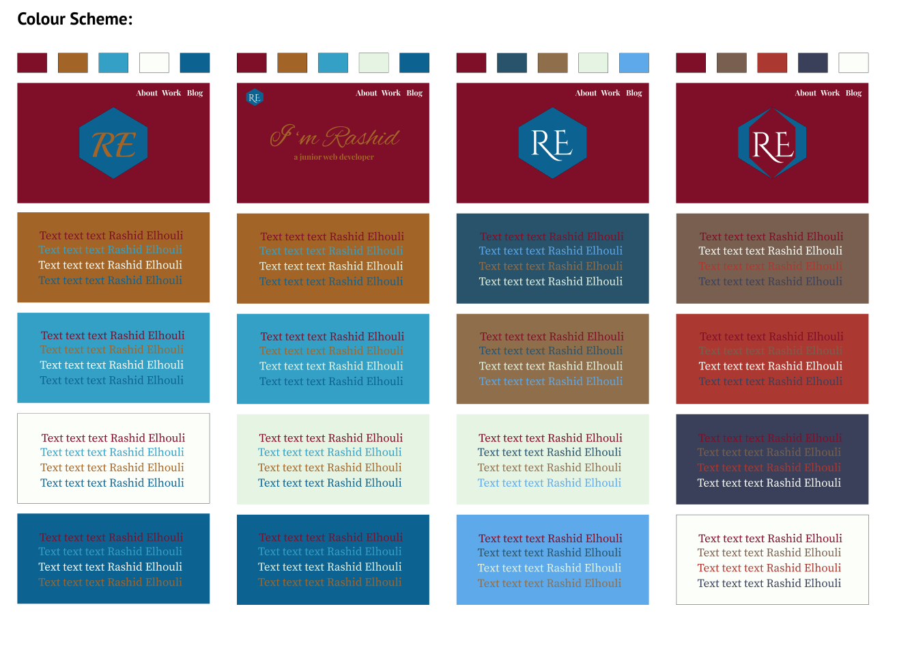
    
Below are the colours I ended up using for my site:
- #7F0E28
- #A36527
- #FBFEF9
- #0C6291
- #35A0C6

This is my palette I chose :

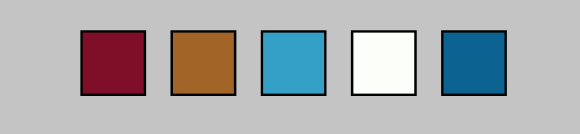

I also got inspiration from images on pinterest, have a look at my [pinterest](https://pin.it/jp4koyn5imecqw).

## **Logo**

I searched the web for my logo design inspiration and cam up with the following images :

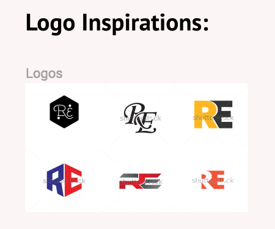 

I then chose one of them and made many iterations and played around with the text and shape. Look at the image below:

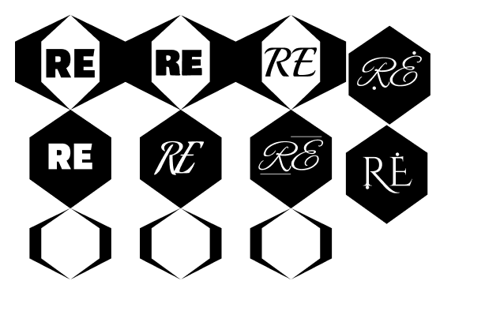

# **Fonts**

I chose 3 fonts of each of serif, san serif and classic. 

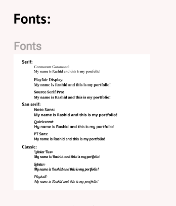

The fonts I went with are:

- PT Sans
- Source Serif Pro

# **Background Colour**

I derived my inspiration from the images below:

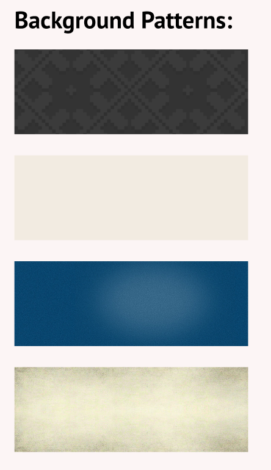

I went with the cream (second image) colour because it suited my design well. 

# **Drafts**

Here are the drafts of my work, I played around with it until I got to my final design. 

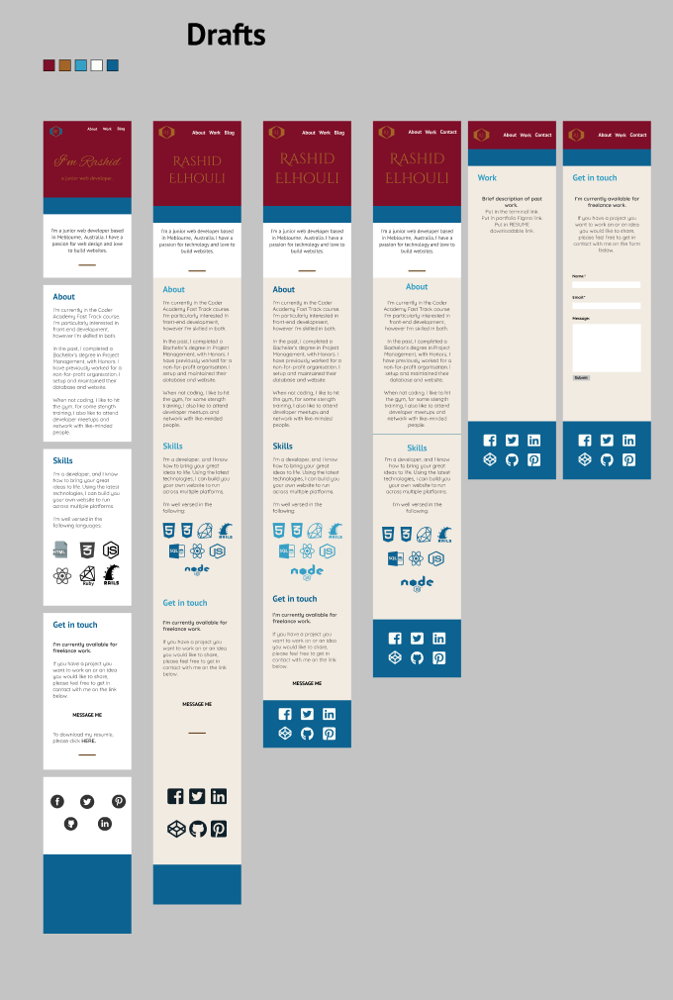

Below is an image of my whole design process:

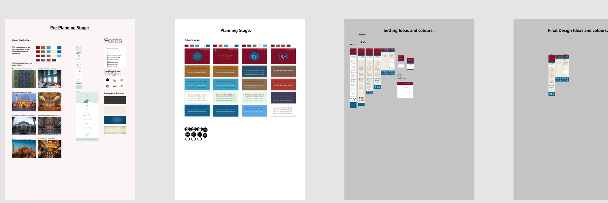

# **Final Designs**

Here are my final designs for my logo and my mobile view for the website. 

LOGO: 

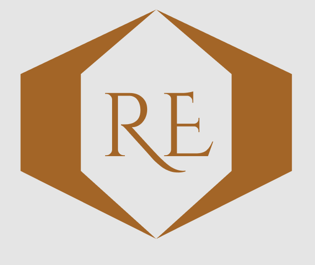

MOBILE VIEW:

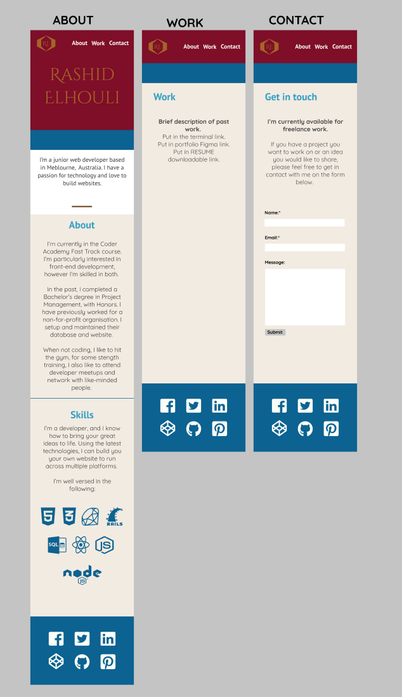

# **Challenges**

I struggled a lot with my top Menu bar; I couldn't get it to stay fixed to the top of the page and within the max margins set. 

I also struggled a lot with my contact form, I couldn't get it to stay centered for desktop view. 

